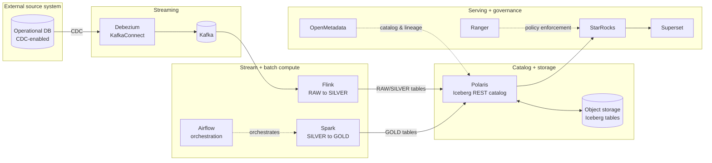

<p align="center">
  
  
  
  
</p>

<h1 align="center">lakehouse-gitops</h1>

<p align="center">
  GitOps source of truth for a governed, HA Iceberg lakehouse running on Kubernetes.
</p>

<p align="center">
  <a href="#quick-start">Quick Start</a> ·
  <a href="#architecture">Architecture</a> ·
  <a href="#repository-layout">Layout</a> ·
  <a href="#component-reference">Components</a> ·
  <a href="#software-versions">Versions</a> ·
  <a href="#known-follow-ups">Known Follow-ups</a>
</p>

---

This repo is the **only** place changes to the lakehouse are made. Everything here is reconciled
onto the cluster by ArgoCD (app-of-apps pattern) — there is no supported path that involves
hand-running `kubectl apply` or `helm install` against anything this repo manages. If it isn't in
git, it doesn't exist on Day-2.

The pipeline: an operational database's change-data-capture stream is picked up by Kafka/Debezium,
landed and conformed by Flink (RAW → SILVER), aggregated by Airflow-orchestrated Spark jobs into
governed Iceberg tables (GOLD), and served to BI tools via StarRocks/Superset — with OpenMetadata
for catalog/lineage and Ranger for access-policy enforcement across the stack.

> **Note on naming:** all hostnames, IP addresses, and node names in this README and its linked
> manifests use placeholder values (`*.example.com`, `203.0.113.0/24` — reserved documentation
> ranges per RFC 2606 / RFC 5737). Replace them with your own before deploying.

## Features

- 🔓 **Fully GitOps-managed** — every Helm values file, CR, and Job lives in git; ArgoCD
  `selfHeal` reverts any manual drift automatically.
- 🧱 **Two independently-destroyable layers** — `platform/` (operators/CRDs, installed once) vs
  `workloads/` (the actual lakehouse data plane), so a routine teardown/rebuild never touches CRDs.
- 🗄️ **Iceberg REST catalog** (Apache Polaris) as the single source of table metadata, backed by
  a real relational store — no split-brain in-memory catalog state across replicas.
- 🐘 **CloudNativePG everywhere** — every component needing a relational database gets its own
  HA CNPG `Cluster`, not a bundled single-instance database chart default.
- 🔁 **Idempotent by construction** — schema-init and bootstrap Jobs are written to be safely
  re-run (`CREATE TABLE IF NOT EXISTS`, `ON CONFLICT DO NOTHING`), since GitOps reconciliation can
  and will re-execute them.
- 🔐 **Governed by default** — OpenMetadata for catalog/lineage, Ranger for policy enforcement,
  wired in from Day-0 rather than bolted on later.

## Architecture



Every arrow above is a real ArgoCD-managed `Application` in this repo — see
[Component reference](#component-reference) for exactly which one.

## Repository layout

```
.
├── bootstrap/     # The two ArgoCD app-of-apps roots (platform-root, workloads-root)
├── infra/         # Namespaces + CNPG Cluster CRs shared across workloads
├── platform/      # Operators/CRDs: installed once, rarely destroyed
│   ├── flink-operator/
│   ├── spark-operator/
│   ├── starrocks-operator/
│   └── strimzi-operator/
├── workloads/     # The lakehouse itself: what `make destroy`/`make redeploy` targets
│   ├── nimbus-cdc-kafka/       # Kafka cluster + Debezium KafkaConnect
│   ├── polaris/                # Iceberg REST catalog
│   ├── flink-jobs/             # RAW -> SILVER streaming jobs
│   ├── spark-jobs/              # SILVER -> GOLD batch jobs
│   ├── airflow/                # Orchestration for the Spark GOLD DAGs
│   ├── starrocks/              # Query engine + external Iceberg catalog registration
│   ├── superset/                # BI layer
│   ├── openmetadata/            # Catalog, lineage, ingestion pipelines
│   ├── openmetadata-dependencies/  # OpenSearch/Airflow bundled by the OpenMetadata chart
│   └── ranger/                  # Policy administration + policies
├── docs/          # Supporting design/reference docs
├── scripts/       # Operational helpers (e.g. CDC traffic simulation wrapper)
└── Makefile       # The only supported entrypoint: deploy / destroy / redeploy / status
```

Every `platform/<x>` and `workloads/<x>` directory contains its own `application.yaml` (an
ArgoCD `Application`) plus the resources it manages, kept unambiguous via either a
`kustomization.yaml` listing only the real resources, or by pointing the Application's source
path at a `manifests/` subfolder (e.g. Airflow) — never mixing the two in one directory listing.

## Quick start

### Day-0 (once, before `make deploy`)

1. Confirm the cluster can reach your external object storage and source database endpoints
   (e.g. a throwaway debug pod with `nc -zv`).
2. Create the out-of-band credential Secrets (database CDC-reader user, object storage
   access/secret key) directly with `kubectl create secret` — **never commit these to git.**
   See each component's own README for exactly which keys it expects.
3. Copy your cluster's wildcard TLS secret into any namespace outside its auto-sync scope, if
   applicable to your ingress setup.
4. Install ArgoCD in the `argocd` namespace (not managed by this repo — chicken/egg).
5. `make deploy`.

A few more Day-0-shaped secrets get created the first time their component actually boots
(documented alongside them, not repeated here): catalog bootstrap credentials, ingestion bot
tokens, and admin credentials for the governance components — see
`workloads/openmetadata/README.md` and `workloads/ranger/README.md`.

### Day-2 operations

| Command | Effect |
|---|---|
| `make status` | Show what's Synced/Healthy vs not, across every ArgoCD Application |
| `make deploy` | Apply the app-of-apps roots (idempotent) |
| `make destroy CONFIRM=yes` | Tear down `workloads-root` only (the data plane). Leaves `platform-root` and all PVs alone |
| `make redeploy CONFIRM=yes` | `destroy` + `deploy` in one step — the actual reproducibility test |
| `make destroy-all CONFIRM=yes` | Also removes `platform-root` and explicitly deletes orphaned PVs — **the only path that discards data** |
| `scripts/simulate_cdc.sh [batch]` | Generate CDC traffic against the source database and walk through the post-deployment verification checklist |

## Component reference

| Component | Namespace | Purpose | Manifests |
|---|---|---|---|
| Kafka + Debezium | `lakehouse-streaming` | CDC event bus + source connector | [`workloads/nimbus-cdc-kafka/`](workloads/nimbus-cdc-kafka) |
| Flink | `lakehouse-streaming` | RAW ingestion + SILVER conforming | [`workloads/flink-jobs/`](workloads/flink-jobs) |
| Polaris | `lakehouse-catalog` | Iceberg REST catalog | [`workloads/polaris/`](workloads/polaris) |
| Spark + Airflow | `lakehouse-orchestration` | Orchestrated GOLD aggregation | [`workloads/spark-jobs/`](workloads/spark-jobs), [`workloads/airflow/`](workloads/airflow) |
| StarRocks | `lakehouse-compute` | Query engine over the Iceberg catalog | [`workloads/starrocks/`](workloads/starrocks) |
| Superset | `lakehouse-bi` | BI dashboards | [`workloads/superset/`](workloads/superset) |
| OpenMetadata | `lakehouse-governance` | Catalog, lineage, discovery | [`workloads/openmetadata/`](workloads/openmetadata) |
| Ranger | `lakehouse-governance` | Access policy administration | [`workloads/ranger/`](workloads/ranger) |

## Software versions

Versions actually pinned in this repo's manifests (Helm `targetRevision` / container image tags),
kept here so drift is visible at a glance instead of buried across a dozen files.

| Software | Version | Pinned in |
|---|---|---|
| Kubernetes (target cluster) | 1.34.x | cluster-provided, not repo-managed |
| ArgoCD | cluster-provided | `argocd` namespace, not repo-managed |
| Strimzi Kafka Operator (chart) | 1.2.0 | `platform/strimzi-operator` |
| Kafka | 4.3.1 | `workloads/nimbus-cdc-kafka` |
| Debezium connect | 2.7 | `workloads/nimbus-cdc-kafka` |
| Flink Kubernetes Operator (chart) | 1.16.0 | `platform/flink-operator` |
| Flink | 1.19 (Scala 2.12 / Java 17) | `workloads/flink-jobs` |
| Spark Operator (chart) | 2.5.2 | `platform/spark-operator` |
| Apache Spark | 3.5.3 | `workloads/spark-jobs` |
| Apache Airflow (chart) | 1.22.0 | `workloads/airflow` |
| Apache Polaris | 1.7.0 | `workloads/polaris` |
| StarRocks Kubernetes Operator (chart) | 1.11.7 | `platform/starrocks-operator` |
| StarRocks FE/BE | 4.1.4 | `workloads/starrocks` |
| Superset (chart) | 5.0.0 | `workloads/superset` |
| OpenMetadata (chart) | 2.0.2 | `workloads/openmetadata`, `workloads/openmetadata-dependencies` |
| OpenMetadata ingestion | 1.5.11 | `workloads/openmetadata/ingestion` |
| Apache Ranger | 2.9.0 | `workloads/ranger` |
| CloudNativePG Postgres image | 16 | `infra/cnpg-clusters` |

## Known follow-ups

Flagged in place, not silently assumed done:

- `workloads/flink-jobs/README.md` — Flink's Iceberg REST client intermittently hits an
  authentication error under Kubernetes Service load-balancing across multiple catalog replicas;
  root-caused and fixed for other consumers via `sessionAffinity`, needs re-verification here.
- `workloads/ranger/README.md` — StarRocks Ranger plugin registration isn't wired yet.
- Exact Helm value schemas were written against the chart versions listed above at authoring
  time — re-verify with `helm show values <chart>` before first deploy on a new cluster, since
  chart defaults change between versions.
- CDC pipeline (Kafka Connect cluster + connector) is defined but not yet fully stood up end to
  end on the current environment — see the component's own README for current status.

## License

Apache License 2.0 — see [`LICENSE`](LICENSE).
